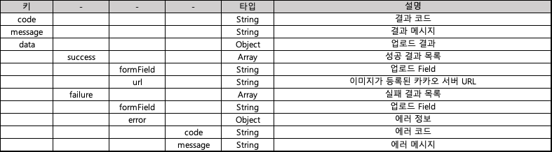

# 비즈메시지 파일 관리

### 친구톡 기본/와이드 이미지 등록

* 친구톡 기본/와이드/프리미엄 동영상/커머스 이미지를 합니다.
* **POST** /v3/kakao/image/upload
* **Content-Type:** multipart/form-data

**Request**

<figure><figcaption></figcaption></figure>

**Response**

<table data-header-hidden><thead><tr><th align="center">Text</th><th width="165.33333333333331" align="center"></th><th width="339" align="center"></th></tr></thead><tbody><tr><td align="center"><strong>키</strong></td><td align="center"><strong>타입</strong></td><td align="center"><strong>설명</strong></td></tr><tr><td align="center">code</td><td align="center">String</td><td align="center">결과 코드</td></tr><tr><td align="center">message</td><td align="center">String</td><td align="center">실패 시 결과 메시지</td></tr><tr><td align="center">image</td><td align="center">String</td><td align="center">성공 시 이미지가 등록된 카카오 서버 URL</td></tr></tbody></table>


### 친구톡 와이드 아이템 리스트 이미지 업로드

* 친구톡 와이드 아이템 리스트 발송 시 사용될 이미지들을 업로드 합니다.\
  아이템 리스트 개수(1\~4개)에 맞춰서 업로드 합니다.\
  제한 사이즈 - 가로 400px, 세로 400px \~ 가로 800px, 세로 400px\
  비율 및 가로 픽셀 확인 X, 썸네일 크기에 맞추어 중앙 기준으로 크롭하여 노출\
  파일 형식 및 크기 : jpg/png / 각 파일 최대 2MB
* **POST** /v3/kakao/image/friendtalk/wideItemList
* **Content-Type** : multipart/form-data


Request parameter

<figure><figcaption></figcaption></figure>

Response parameter

<figure><figcaption></figcaption></figure>


### 친구톡 캐러셀 피드 이미지 업로드

* 친구톡 캐러셀 피드 발송 시 사용될 이미지를 업로드 합니다.\
  캐러셀 개수(1\~10개)에 맞춰서 업로드 합니다.\
  제한 사이즈 - 가로 500px 이상, 가로:세로 비율 2:1 이상 3:4 이하\
  파일형식 및 크기 : jpg, png / 각 파일 최대 5MB
* **POST** /v3/kakao/image/friendtalk/carousel
* **Content-Type** : multipart/form-data\


Request parameter

<figure><figcaption></figcaption></figure>

Response parameter

<figure><figcaption></figcaption></figure>

Response example

```json
{
  "code": "0000",
  "message": "요청 성공",
  "data": {
    "success": [
      {
        "formField": "image_1",
        "url": "https://mud-kage.kakao.com/dn/b5E6Yr/btsa5VHWWxy/0XBBKw3gSXepAAWRTwSjX0/img_l.jpg"
      },
      {
        "formField": "image_2",
        "url": "https://mud-kage.kakao.com/dn/bgUBUP/btsa9InbW8K/KXAZ7zpguOehy8IvomTs70/img_l.jpg"
      }
    ],
    "failure": null
  }
}

```


### 친구톡 캐러셀 커머스 이미지 등록

*   친구톡 캐러셀 커머스 발송 시 사용될 이미지를 업로드 합니다.

    캐러셀  개수(1\~11개)에 맞춰서 업로드 합니다.

    제한 사이즈 - 가로 500px 이상, 가로:세로 비율 2:1 이상 3:4 이하

    파일형식 및 크기 : jpg, png / 각 파일 최대 5MB
* **POST** /v3/kakao/image/friendtalk/carouselCommerce
* **Content-Type:** multipart/form-data

Request parameter

<figure><figcaption></figcaption></figure>

Response parameter

<figure><figcaption></figcaption></figure>

Response example

```
{
  "code": "6000",
  "message": "요청 성공",
  "data": {
    "success": [
      {
        "formField": "image_2",
        "url": "https://mud-kage.kakao.com/dn/cyRwF2/btsbmPfwwq4/GFYlmhCcldaydDc7pqH7g0/img_l.jpg"
      }
    ],
    "failure": [
      {
        "formField": "image_1",
        "error": {
          "code": "2002",
          "message": "InvalidImageShapeException(가로는 최소 500px, 세로는 최소 250px 이상이어야 합니다)"
        }
      }
    ]
  }
}
```


### 친구톡 이미지 조회

* 친구톡 이미지 목록을 조회 합니다.
* **POST** /v3/kakao/image/list
* **Content-Type:** application/json; charset=utf-8

**Request**

<table data-header-hidden data-full-width="false"><thead><tr><th align="center">Text</th><th align="center"></th><th width="380" align="center"></th><th align="center">필수</th></tr></thead><tbody><tr><td align="center"><strong>키</strong></td><td align="center"><strong>타입</strong></td><td align="center"><strong>설명</strong></td><td align="center"><strong>필수</strong></td></tr><tr><td align="center">bizId</td><td align="center">String</td><td align="center">BIZPPURIO ID</td><td align="center">O</td></tr><tr><td align="center">apiKey</td><td align="center">String</td><td align="center">API 발급 키</td><td align="center">O</td></tr><tr><td align="center">senderKey</td><td align="center">String</td><td align="center"><p>발신프로필키<br>(<strong>입력시</strong> : 해당 발신프로필키에 매핑된 이미지 조회, </p><p><strong>미입력시</strong> : 공용(해당계정)으로 매핑된 이미지 조회)</p></td><td align="center">X</td></tr><tr><td align="center">imageType</td><td align="center">String</td><td align="center"><p>이미지 타입(기본=I, 와이드=W, </p><p>와이드아이템리스트=L, 캐러셀피드=C, </p><p>프리미엄동영상=V, 커머스=M, 캐러셀커머스=A)</p></td><td align="center">O</td></tr></tbody></table>

**Response**

<table data-header-hidden><thead><tr><th width="150" align="center"></th><th width="150" align="center"></th><th width="150" align="center"></th><th width="250" align="center"></th></tr></thead><tbody><tr><td align="center"><strong>키</strong></td><td align="center"></td><td align="center"><strong>타입</strong></td><td align="center"><strong>설명</strong></td></tr><tr><td align="center">code</td><td align="center"></td><td align="center">String</td><td align="center">결과 코드</td></tr><tr><td align="center">message</td><td align="center"></td><td align="center">String</td><td align="center">실패 시 결과 메시지</td></tr><tr><td align="center">data</td><td align="center"></td><td align="center">Array</td><td align="center">성공 시 이미지 목록</td></tr><tr><td align="center"></td><td align="center">title</td><td align="center">String</td><td align="center">이미지 제목</td></tr><tr><td align="center"></td><td align="center">link</td><td align="center">String</td><td align="center">이미지 클릭 시 이동할 URL<br>(http:// 또는 https:// 포함)</td></tr><tr><td align="center"></td><td align="center">imageUrl</td><td align="center">String</td><td align="center">이미지가 등록된 카카오 서버 URL</td></tr><tr><td align="center"></td><td align="center">createdAt</td><td align="center">String</td><td align="center">이미지 등록일</td></tr><tr><td align="center"></td><td align="center">imageType</td><td align="center">String</td><td align="center">이미지 타입<br>(기본=I, 와이드=W)</td></tr></tbody></table>


### 친구톡 이미지 삭제

* 등록된 친구톡 이미지를 삭제합니다.
* **POST** /v3/kakao/image/delete
* **Content-Type:** application/json; charset=utf-8

**Request**

<table data-header-hidden><thead><tr><th width="165.81471389645776" align="center">Text</th><th width="150" align="center"></th><th width="150" align="center">필수</th><th width="234" align="center"></th></tr></thead><tbody><tr><td align="center"><strong>키</strong></td><td align="center"><strong>타입</strong></td><td align="center"><strong>필수</strong></td><td align="center"><strong>설명</strong></td></tr><tr><td align="center">bizId</td><td align="center">String</td><td align="center">O</td><td align="center">BIZPPURIO ID</td></tr><tr><td align="center">apiKey</td><td align="center">String</td><td align="center">O</td><td align="center">API 발급 키</td></tr><tr><td align="center">imageUrl</td><td align="center">String</td><td align="center">O</td><td align="center">삭제할 이미지 URL 정보</td></tr></tbody></table>

**Response**

<table data-header-hidden><thead><tr><th align="center">Text</th><th width="165.33333333333331" align="center"></th><th width="339" align="center"></th></tr></thead><tbody><tr><td align="center"><strong>키</strong></td><td align="center"><strong>타입</strong></td><td align="center"><strong>설명</strong></td></tr><tr><td align="center">code</td><td align="center">String</td><td align="center">결과 코드</td></tr><tr><td align="center">message</td><td align="center">String</td><td align="center">실패 시 결과 메시지</td></tr></tbody></table>


### 알림톡 템플릿 등록용 이미지 업로드

* 강조유형이  이미지형 또는 아이템리스트형인 알림톡 템플릿 등록 시 사용될 이미지를 업로드 합니다.&#x20;

&#x20;       제한 사이즈 - 가로 500px 이상, 가로:세로 비율 2:1&#x20;

&#x20;       파일형식 및 크기 : jpg, png / 최대 500KB

* **POST** /v3/kakao/image/alimtalk/template
* **Content-Type:** multipart/form-data

**Request**

<table data-header-hidden><thead><tr><th width="165.81471389645776" align="center">Text</th><th width="150" align="center"></th><th width="150" align="center">필수</th><th width="234" align="center"></th></tr></thead><tbody><tr><td align="center"><strong>키</strong></td><td align="center"><strong>타입</strong></td><td align="center"><strong>필수</strong></td><td align="center"><strong>설명</strong></td></tr><tr><td align="center">bizId</td><td align="center">String</td><td align="center">O</td><td align="center">BIZPPURIO ID</td></tr><tr><td align="center">apiKey</td><td align="center">String</td><td align="center">O</td><td align="center">API 발급 키</td></tr><tr><td align="center">image</td><td align="center">File</td><td align="center">O</td><td align="center">업로드할 이미지 파일</td></tr></tbody></table>

**Response**

<table data-header-hidden><thead><tr><th align="center">Text</th><th width="165.33333333333331" align="center"></th><th width="339" align="center"></th></tr></thead><tbody><tr><td align="center"><strong>키</strong></td><td align="center"><strong>타입</strong></td><td align="center"><strong>설명</strong></td></tr><tr><td align="center">code</td><td align="center">String</td><td align="center">결과 코드</td></tr><tr><td align="center">message</td><td align="center">String</td><td align="center">실패 시 결과 메시지</td></tr><tr><td align="center">image</td><td align="center">String</td><td align="center">성공 시 이미지가 등록된 카카오 서버 URL</td></tr></tbody></table>


### 알림톡 하이라이트 이미지 업로드

* 아이템리스트 알림톡 발송 시 사용될 아이템 하이라이트 이미지를 업로드 합니다.&#x20;

&#x20;       제한 사이즈 - 가로 108px 이상, 가로:세로 비율이 1:1&#x20;

&#x20;       파일형식 및 크기 : jpg, png / 최대 500KB&#x20;

* **POST** /v3/kakao/image/alimtalk/itemHighlight
* **Content-Type:** multipart/form-data

**Request**

<table data-header-hidden><thead><tr><th width="165.81471389645776" align="center">Text</th><th width="150" align="center"></th><th width="150" align="center">필수</th><th width="234" align="center"></th></tr></thead><tbody><tr><td align="center"><strong>키</strong></td><td align="center"><strong>타입</strong></td><td align="center"><strong>필수</strong></td><td align="center"><strong>설명</strong></td></tr><tr><td align="center">bizId</td><td align="center">String</td><td align="center">O</td><td align="center">BIZPPURIO ID</td></tr><tr><td align="center">apiKey</td><td align="center">String</td><td align="center">O</td><td align="center">API 발급 키</td></tr><tr><td align="center">image</td><td align="center">File</td><td align="center">O</td><td align="center">업로드할 이미지 파일</td></tr></tbody></table>

**Response**

<table data-header-hidden><thead><tr><th align="center">Text</th><th width="165.33333333333331" align="center"></th><th width="339" align="center"></th></tr></thead><tbody><tr><td align="center"><strong>키</strong></td><td align="center"><strong>타입</strong></td><td align="center"><strong>설명</strong></td></tr><tr><td align="center">code</td><td align="center">String</td><td align="center">결과 코드</td></tr><tr><td align="center">message</td><td align="center">String</td><td align="center">실패 시 결과 메시지</td></tr><tr><td align="center">image</td><td align="center">String</td><td align="center">성공 시 이미지가 등록된 카카오 서버 URL</td></tr></tbody></table>
